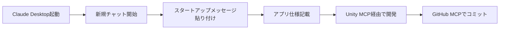

# 📋 VR開発環境ベースライン仕様書

## 🎯 このドキュメントの目的

このドキュメントは、Meta Quest 3 VR開発を何度でも同じ状態から開始できるようにするための、環境ベースライン仕様書です。新しいClaude Desktopチャットを開始する際の参照資料として使用してください。

## 🔧 環境構成（2025年8月12日時点）

### システム環境
```yaml
OS: Windows 10/11 (64-bit)
Unity: 2022.3.62f1 LTS
Unity Hub: v3.13.1
Android Studio: Meerkat 2024.3.1 Patch 2
Meta Quest Developer Hub: v4.0.0+
Python: 3.13.3
Node.js: v18.20.8
Git: v2.50.1
```

### Unity プロジェクト設定
```yaml
プロジェクト名: MetaQuest3Template
プロジェクトパス: C:\UnityProjects\MetaQuest3Template
テンプレート: 3D URP (Universal Render Pipeline)
プラットフォーム: Android
ターゲットデバイス: Meta Quest 3
```

### MCP (Model Context Protocol) 設定
```yaml
Unity MCP:
  ポート: 6400
  状態: 自動起動・接続済み
  機能: GameObject操作、スクリプト作成、コンソール管理、シーン管理

GitHub MCP:
  認証: Personal Access Token
  リポジトリ: YaAkiyama/MetaQuest3-VR-Template
  機能: リポジトリ管理、Issue管理、ファイル操作
```

## 📦 インストール済みUnityパッケージ

### 必須パッケージ
| パッケージ名 | バージョン | 用途 |
|------------|-----------|------|
| com.unity.xr.openxr | 1.10.0+ | OpenXR基本機能 |
| com.unity.xr.meta-openxr | 1.0.4+ | Meta Quest対応 |
| com.unity.xr.interaction.toolkit | 3.0.8+ | VRインタラクション |
| com.unity.mobile.android-logcat | 1.4.2+ | Androidデバッグ |
| com.justinpbarnett.unity-mcp | latest | Unity MCP Bridge |

## 🎮 ベースラインシーン構成

### シーンファイル
- **作業用**: `Assets/Scenes/mq3template.unity`
- **ベースライン**: `Assets/Scenes/mq3template_baseline.unity`

### GameObject階層
```
mq3template_baseline.unity
├── Directional Light
│   └── Transform: Position(0, 3, 0), Rotation(50, 330, 0)
│
├── XR Interaction Manager
│   └── 全VRインタラクションの中央管理
│
├── XR Origin (XR Rig)
│   └── Camera Offset (Height: 1.1176m)
│       ├── Main Camera (Tag: MainCamera)
│       ├── Left Controller
│       │   └── XR Controller (Action Based)
│       └── Right Controller
│           ├── XR Controller (Action Based)
│           ├── XR Ray Interactor
│           ├── Line Renderer
│           └── VRLaserPointer.cs
│
├── VR UI Panel
│   ├── Transform: Position(0, 2, 3)
│   ├── Canvas (World Space)
│   ├── Canvas Scaler
│   └── Graphic Raycaster
│
└── EventSystem
    └── XR UI Input Module対応
```

## 🎨 VRLaserPointer設定

### デフォルト値
```csharp
laserMaxLength = 10f        // レーザーの最大長
laserWidth = 0.01f         // レーザーの太さ
laserColor = Color.cyan    // 通常時の色
hitColor = Color.green     // ヒット時の色
```

## ⚙️ Unityプロジェクト設定値

### Build Settings
```yaml
Platform: Android
Texture Compression: ASTC
Run Device: Quest 3 (接続時)
Development Build: OFF (本番用)
```

### Player Settings (Android)
```yaml
Company Name: DefaultCompany
Product Name: MetaQuest3Template
Package Name: com.defaultcompany.metaquest3template
Minimum API Level: 26 (Android 8.0)
Target API Level: 33 (Android 13.0)
Scripting Backend: IL2CPP
Api Compatibility: .NET Standard 2.1
Target Architectures: ARM64
```

### XR Plug-in Management
```yaml
Plug-in Provider: OpenXR
OpenXR Feature Groups:
  - Meta Quest Support: ✓
  - Meta Quest Pro Support: ✓
Interaction Profiles:
  - Oculus Touch Controller Profile: ✓
```

### Graphics Settings
```yaml
Scriptable Render Pipeline: URP Asset
HDR: Disabled (パフォーマンス優先)
MSAA: 2x
Shadow Distance: 50m
Post Processing: Disabled (初期状態)
```

## 📁 プロジェクトディレクトリ構造

```
C:\UnityProjects\MetaQuest3Template\
├── Assets/
│   ├── Scenes/
│   │   ├── mq3template.unity
│   │   └── mq3template_baseline.unity
│   ├── Scripts/
│   │   └── VRLaserPointer.cs
│   ├── Materials/
│   ├── Prefabs/
│   ├── Textures/
│   └── Settings/
│       └── URP-HighFidelity-Renderer.asset
├── Packages/
│   ├── manifest.json
│   └── packages-lock.json
├── ProjectSettings/
├── UserSettings/
└── Library/ (自動生成)
```

## 🔄 開発サイクル

### 新規開発開始フロー


### リセット方法
1. **シーンリセット**: ベースラインシーンを開く
2. **Gitリセット**: `git checkout .`
3. **完全リセット**: プロジェクトをGitHubから再クローン

## 🚨 注意事項

### やってはいけないこと
- ❌ Unity 2022.3.22f1の使用（ビルドエラー）
- ❌ Unity 6の使用（Quest 3パフォーマンス問題）
- ❌ ベースラインシーンの直接編集
- ❌ Unity MCPポートの変更

### 推奨事項
- ✅ 作業前にベースラインシーンをコピー
- ✅ 定期的なGitコミット
- ✅ コンソールエラーの即時確認
- ✅ Quest 3実機での定期テスト

## 📊 パフォーマンス目標

| 指標 | 目標値 | 最大許容値 |
|------|-------|-----------|
| FPS | 90 | 72 |
| Draw Call | 100 | 150 |
| 三角形数 | 50k | 100k |
| テクスチャメモリ | 512MB | 1GB |
| バッチング | 動的 | - |

## 🔗 関連リソース

### GitHub
- リポジトリ: https://github.com/YaAkiyama/MetaQuest3-VR-Template
- Issue #1: Quest 3実機ビルドテスト

### ドキュメント
- QUICK_START_GUIDE.md: クイックスタートガイド
- README.md: プロジェクト概要
- Documentation/PROJECT_STRUCTURE.md: 詳細構成

### 外部リンク
- [Unity XR Interaction Toolkit](https://docs.unity3d.com/Packages/com.unity.xr.interaction.toolkit@3.0/manual/index.html)
- [Meta Quest Developer](https://developer.meta.com/)
- [OpenXR Specification](https://www.khronos.org/openxr/)

## 📝 バージョン履歴

| バージョン | 日付 | 変更内容 |
|-----------|------|----------|
| v1.0.0 | 2025-08-12 | 初期ベースライン作成 |
| - | - | テストオブジェクト削除 |
| - | - | VRレーザーポインター統合 |
| - | - | GitHub連携確立 |

---

**このドキュメントは開発のベースラインを定義しています。**
**新規開発時は必ずこの状態から開始してください。**